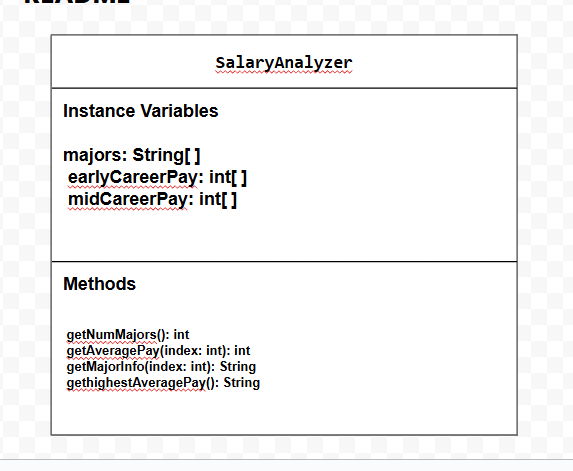

# Unit 3 - Data for Social Good Project

## Introduction

Software engineers develop programs to work with data and provide information to a user. Each user has different needs based on the information they are looking for from data. Your goal is to create a data analysis program for your user that stores and analyzes data to provide the information they need.

## User Story

> As an [student who wants to make money],   
> I want to [analyze the salaries of majors],   
> so that I can [find which major makes the most money].

## Dataset 

Dataset:[U.S. Post College Salaries](https://www.kaggle.com/datasets/rathoddharmendra/post-college-salaries)
- **Major** (String) - college major
- **Early Carrer Pay** (int) - carrer pay early in carrer
- **Mid Carrer Pay** (int) - carrer pay mid way through career

## UML Diagram 

## Description 

My project uses a dataset about post-college salaries to help a user see how different majors compare. I filtered the data so each major only shows up once, then organized the information to only the information I required. The user story is about helping a student pick a major based on salary outcomes. The code displays in the console the salaris early in, mid way or the entire average of a major's jobs pay. It also displays the highest paying salary for a major.
